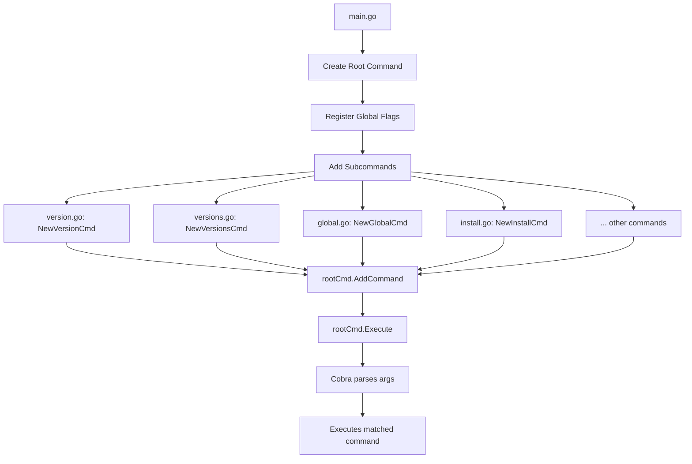
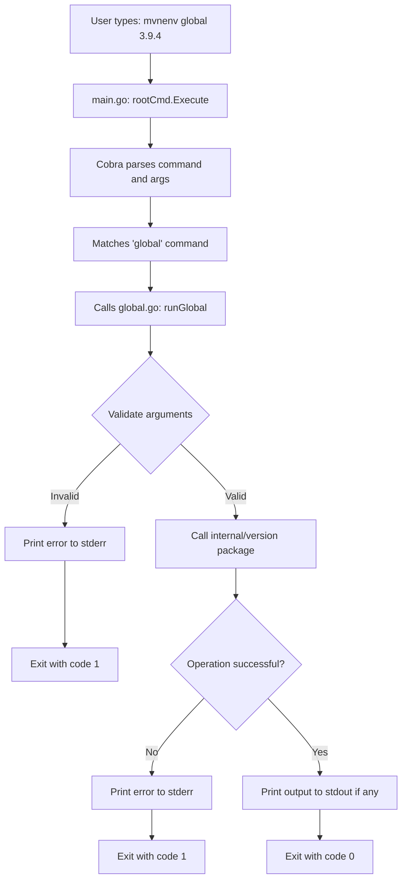

# Design Document

## Overview

The CLI Commands feature implements the foundational command-line interface framework for mvnenv-win using the Cobra library. This design establishes a modular, extensible command structure that mirrors pyenv-win's proven UX while providing the infrastructure for all other mvnenv-win features to build upon.

The framework handles command registration, parsing, help generation, error handling, and output formatting. Business logic for specific commands (version management, repository configuration, shim operations) resides in separate internal packages and will be implemented in other specs.

**Key Design Principles:**
- Cobra-based command structure for robust CLI handling
- Each command is a separate file for modularity
- Plain text output matching pyenv-win conventions (no colors, emojis, or decorative elements)
- Minimal output: setter commands silent on success
- Fast execution through lazy loading and minimal initialization

## Steering Document Alignment

### Technical Standards (tech.md)

**Language and Framework:**
- **Go 1.21+**: Implementation language per tech.md
- **github.com/spf13/cobra v1.8+**: CLI framework as specified in tech.md dependencies
- **Command Pattern**: Each command as discrete module per tech.md architecture

**Architecture Alignment:**
- **Modular Command-Line Architecture**: Follows tech.md's command pattern design
- **Configuration Singleton**: Uses Viper for centralized config per tech.md
- **Performance Requirements**: <50ms startup, <100ms help generation per tech.md

**Dependency Usage:**
- **cobra**: Command structure, parsing, help generation
- **viper**: Configuration management (loaded lazily)
- **os**: Standard library for stdout/stderr, exit codes

### Project Structure (structure.md)

**Directory Organization:**
```
cmd/mvnenv/               # Main CLI entry point per structure.md
├── main.go              # Application entry point, Cobra root setup
├── commands.go          # "commands" command implementation
├── version.go           # "version" command implementation
├── versions.go          # "versions" command implementation
├── global.go            # "global" command implementation
├── local.go             # "local" command implementation
├── shell.go             # "shell" command implementation
├── install.go           # "install" command implementation
├── uninstall.go         # "uninstall" command implementation
├── update.go            # "update" command implementation
├── rehash.go            # "rehash" command implementation
├── which.go             # "which" command implementation
├── latest.go            # "latest" command implementation
└── help.go              # "help" command (Cobra built-in wrapped)
```

**Naming Conventions:**
- Files: `snake_case.go` per structure.md
- Exported functions: `PascalCase`
- Unexported functions: `camelCase`
- Command constructors: `NewVersionCmd()`, `NewInstallCmd()`, etc.

**Code Organization Pattern (per structure.md):**
1. Package declaration and documentation
2. Imports (stdlib, third-party, internal)
3. Command constructor function
4. Command run function
5. Helper functions (unexported)

## Code Reuse Analysis

### Existing Components to Leverage

**None - This is Foundation Code**

This spec implements the CLI framework foundation. Future specs will leverage this infrastructure:

- **core-version-management**: Will register install/uninstall/versions commands using this framework
- **nexus-repository-integration**: Will add repo-related commands using this structure
- **shim-system-implementation**: Will implement rehash/which commands leveraging this foundation

### Integration Points for Future Specs

**Command Registration Pattern:**
Other specs will add commands by creating command files in `cmd/mvnenv/` that follow this pattern:

```go
// NewInstallCmd creates the install command
// (Implementation in core-version-management spec)
func NewInstallCmd() *cobra.Command {
    cmd := &cobra.Command{
        Use:   "install [version...]",
        Short: "Install one or more Maven versions",
        RunE:  runInstall,
    }
    cmd.Flags().BoolP("list", "l", false, "List available versions")
    cmd.Flags().BoolP("quiet", "q", false, "Suppress non-error output")
    return cmd
}
```

**Internal Package Dependencies:**
Commands will call internal packages for business logic:
- `internal/version`: Version management operations
- `internal/config`: Configuration access
- `internal/environment`: PATH and environment manipulation
- `internal/shim`: Shim generation and management

## Architecture

### Overall Design Pattern

**Cobra Command Tree Architecture:**

```
mvnenv (root)
├── commands         # List all commands
├── version          # Show current Maven version
├── versions         # List installed versions
├── global [ver]     # Set/show global version
├── local [ver]      # Set/show local version
├── shell [ver]      # Set/show shell version
├── install [ver...] # Install Maven version(s)
│   └── flags: -l (list), -q (quiet)
├── uninstall [ver...] # Uninstall version(s)
├── update           # Update version cache
├── rehash           # Rebuild shims
├── which <cmd>      # Show command path
├── latest [prefix]  # Show latest version
└── help [cmd]       # Show help
```

### Modular Design Principles

**Single File Responsibility:**
Each command in a separate file (`version.go`, `install.go`, etc.) containing:
- Command constructor
- Command execution logic
- Command-specific helpers

**Component Isolation:**
- Root command setup in `main.go`
- Each subcommand in its own file
- Shared utilities in separate helper files

**Service Layer Separation:**
- CLI layer (`cmd/mvnenv/`): Command parsing, flag handling, output formatting
- Business logic layer (`internal/`): Version management, config, operations
- This spec implements CLI layer only

### Command Registration Flow



### Command Execution Flow



## Components and Interfaces

### Component 1: Root Command (main.go)

**Purpose:** Initialize Cobra root command, register all subcommands, handle global flags and execution

**Interfaces:**
```go
// main function - entry point
func main()

// initRootCmd initializes the root cobra command
func initRootCmd() *cobra.Command

// Execute runs the root command
func Execute() error
```

**Implementation:**
```go
var rootCmd = &cobra.Command{
    Use:   "mvnenv",
    Short: "Maven version manager for Windows",
    Long:  `mvnenv manages multiple Maven installations...`,
    SilenceErrors: true, // We handle errors ourselves
    SilenceUsage:  true, // Don't show usage on every error
}

func init() {
    // Register global flags
    rootCmd.PersistentFlags().BoolP("quiet", "q", false, "Suppress non-error output")

    // Add all subcommands
    rootCmd.AddCommand(NewCommandsCmd())
    rootCmd.AddCommand(NewVersionCmd())
    rootCmd.AddCommand(NewVersionsCmd())
    rootCmd.AddCommand(NewGlobalCmd())
    rootCmd.AddCommand(NewLocalCmd())
    rootCmd.AddCommand(NewShellCmd())
    rootCmd.AddCommand(NewInstallCmd())
    rootCmd.AddCommand(NewUninstallCmd())
    rootCmd.AddCommand(NewUpdateCmd())
    rootCmd.AddCommand(NewRehashCmd())
    rootCmd.AddCommand(NewWhichCmd())
    rootCmd.AddCommand(NewLatestCmd())
}

func main() {
    if err := rootCmd.Execute(); err != nil {
        fmt.Fprintln(os.Stderr, err)
        os.Exit(1)
    }
}
```

**Dependencies:**
- `github.com/spf13/cobra`
- All command constructors (NewVersionCmd, NewInstallCmd, etc.)

### Component 2: Commands Command (commands.go)

**Purpose:** List all available commands (pyenv-win compatibility)

**Interfaces:**
```go
// NewCommandsCmd creates the commands command
func NewCommandsCmd() *cobra.Command

// runCommands executes the commands command
func runCommands(cmd *cobra.Command, args []string) error
```

**Implementation:**
```go
func NewCommandsCmd() *cobra.Command {
    return &cobra.Command{
        Use:   "commands",
        Short: "List all available mvnenv commands",
        RunE:  runCommands,
    }
}

func runCommands(cmd *cobra.Command, args []string) error {
    // Get all commands from root
    commands := cmd.Root().Commands()
    for _, c := range commands {
        if !c.Hidden {
            fmt.Println(c.Name())
        }
    }
    return nil
}
```

**Dependencies:**
- `fmt`, `os`
- Cobra command tree

### Component 3: Version Command (version.go)

**Purpose:** Display currently active Maven version

**Interfaces:**
```go
// NewVersionCmd creates the version command
func NewVersionCmd() *cobra.Command

// runVersion executes the version command
func runVersion(cmd *cobra.Command, args []string) error
```

**Implementation:**
```go
func NewVersionCmd() *cobra.Command {
    return &cobra.Command{
        Use:   "version",
        Short: "Show the current Maven version",
        RunE:  runVersion,
    }
}

func runVersion(cmd *cobra.Command, args []string) error {
    // Business logic in internal/version package (other spec)
    // This spec defines the command structure only

    // Pseudocode for future implementation:
    // resolver := version.NewResolver()
    // ver, err := resolver.GetCurrentVersion()
    // if err != nil {
    //     return fmt.Errorf("Error: %w", err)
    // }
    // if ver == "" {
    //     fmt.Println("No Maven version set")
    //     return nil
    // }
    // fmt.Println(ver)
    // return nil

    // For this spec (CLI framework only):
    fmt.Println("3.9.4") // Placeholder
    return nil
}
```

**Dependencies:**
- `fmt`, `os`
- `internal/version` (implementation in other spec)

### Component 4: Versions Command (versions.go)

**Purpose:** List all installed Maven versions, marking current with `*`

**Interfaces:**
```go
// NewVersionsCmd creates the versions command
func NewVersionsCmd() *cobra.Command

// runVersions executes the versions command
func runVersions(cmd *cobra.Command, args []string) error
```

**Implementation:**
```go
func NewVersionsCmd() *cobra.Command {
    return &cobra.Command{
        Use:   "versions",
        Short: "List all installed Maven versions",
        RunE:  runVersions,
    }
}

func runVersions(cmd *cobra.Command, args []string) error {
    // Business logic in internal/version package
    // Pseudocode:
    // manager := version.NewManager()
    // versions, err := manager.ListInstalled()
    // current, _ := resolver.GetCurrentVersion()
    // for _, v := range versions {
    //     if v == current {
    //         fmt.Printf("* %s\n", v)
    //     } else {
    //         fmt.Printf("  %s\n", v)
    //     }
    // }

    // Placeholder for CLI framework spec:
    fmt.Println("* 3.9.4")
    fmt.Println("  3.8.6")
    return nil
}
```

**Dependencies:**
- `fmt`, `os`
- `internal/version` (implementation in other spec)

### Component 5: Global/Local/Shell Commands

**Purpose:** Set or show Maven version at different scopes

**Interfaces:**
```go
// NewGlobalCmd creates the global command
func NewGlobalCmd() *cobra.Command

// NewLocalCmd creates the local command
func NewLocalCmd() *cobra.Command

// NewShellCmd creates the shell command
func NewShellCmd() *cobra.Command

// runGlobal executes the global command
func runGlobal(cmd *cobra.Command, args []string) error

// runLocal executes the local command
func runLocal(cmd *cobra.Command, args []string) error

// runShell executes the shell command
func runShell(cmd *cobra.Command, args []string) error
```

**Implementation Pattern (global.go example):**
```go
func NewGlobalCmd() *cobra.Command {
    return &cobra.Command{
        Use:   "global [version]",
        Short: "Set or show the global Maven version",
        Args:  cobra.MaximumNArgs(1),
        RunE:  runGlobal,
    }
}

func runGlobal(cmd *cobra.Command, args []string) error {
    if len(args) == 0 {
        // Show current global version
        // Call internal/version.GetGlobalVersion()
        fmt.Println("3.9.4") // Placeholder
        return nil
    }

    // Set global version
    version := args[0]
    // Call internal/version.SetGlobalVersion(version)

    // On success, output nothing (pyenv-win convention)
    return nil
}
```

**Shell Command Special Handling:**
```go
func NewShellCmd() *cobra.Command {
    cmd := &cobra.Command{
        Use:   "shell [version]",
        Short: "Set or show the shell-specific Maven version",
        RunE:  runShell,
    }
    cmd.Flags().Bool("unset", false, "Unset shell version")
    return cmd
}

func runShell(cmd *cobra.Command, args []string) error {
    unset, _ := cmd.Flags().GetBool("unset")

    if unset {
        // Unset shell version
        // Call internal/version.UnsetShellVersion()
        return nil
    }

    if len(args) == 0 {
        // Show current shell version
        // Call internal/version.GetShellVersion()
        fmt.Println("3.8.6") // Placeholder
        return nil
    }

    // Set shell version (via environment variable)
    version := args[0]
    // Call internal/version.SetShellVersion(version)
    return nil
}
```

**Dependencies:**
- `fmt`, `os`
- `internal/version` (implementation in other spec)
- `internal/config` (paths, validation)

### Component 6: Install Command (install.go)

**Purpose:** Install Maven versions or list available versions

**Interfaces:**
```go
// NewInstallCmd creates the install command
func NewInstallCmd() *cobra.Command

// runInstall executes the install command
func runInstall(cmd *cobra.Command, args []string) error
```

**Implementation:**
```go
func NewInstallCmd() *cobra.Command {
    cmd := &cobra.Command{
        Use:   "install [version...]",
        Short: "Install one or more Maven versions",
        RunE:  runInstall,
    }
    cmd.Flags().BoolP("list", "l", false, "List available versions")
    cmd.Flags().BoolP("quiet", "q", false, "Suppress non-error output")
    return cmd
}

func runInstall(cmd *cobra.Command, args []string) error {
    list, _ := cmd.Flags().GetBool("list")
    quiet, _ := cmd.Flags().GetBool("quiet")

    if list {
        // List available versions
        // Call internal/version.ListAvailable()
        fmt.Println("3.9.4")
        fmt.Println("3.8.6")
        fmt.Println("3.6.3")
        return nil
    }

    if len(args) == 0 {
        return fmt.Errorf("Error: no version specified")
    }

    // Install each version
    for _, version := range args {
        if !quiet {
            fmt.Printf("Installing Maven %s...\n", version)
        }
        // Call internal/version.Install(version)
    }

    return nil
}
```

**Dependencies:**
- `fmt`, `os`
- `internal/version` (install logic in other spec)
- `internal/download` (download logic in other spec)

### Component 7: Uninstall Command (uninstall.go)

**Purpose:** Uninstall one or more Maven versions

**Interfaces:**
```go
// NewUninstallCmd creates the uninstall command
func NewUninstallCmd() *cobra.Command

// runUninstall executes the uninstall command
func runUninstall(cmd *cobra.Command, args []string) error
```

**Implementation:**
```go
func NewUninstallCmd() *cobra.Command {
    return &cobra.Command{
        Use:   "uninstall <version...>",
        Short: "Uninstall one or more Maven versions",
        Args:  cobra.MinimumNArgs(1),
        RunE:  runUninstall,
    }
}

func runUninstall(cmd *cobra.Command, args []string) error {
    // Uninstall each version
    for _, version := range args {
        // Call internal/version.Uninstall(version)
        fmt.Printf("Uninstalling Maven %s\n", version)
    }
    return nil
}
```

**Dependencies:**
- `fmt`, `os`
- `internal/version` (uninstall logic in other spec)

### Component 8: Utility Commands

**Update Command (update.go):**
```go
func NewUpdateCmd() *cobra.Command {
    return &cobra.Command{
        Use:   "update",
        Short: "Update the cached version database",
        RunE:  runUpdate,
    }
}

func runUpdate(cmd *cobra.Command, args []string) error {
    // Call internal/version.UpdateCache()
    fmt.Println("Updating version cache...")
    return nil
}
```

**Rehash Command (rehash.go):**
```go
func NewRehashCmd() *cobra.Command {
    return &cobra.Command{
        Use:   "rehash",
        Short: "Rebuild shim executables",
        RunE:  runRehash,
    }
}

func runRehash(cmd *cobra.Command, args []string) error {
    // Call internal/shim.Rebuild()
    return nil // Silent on success
}
```

**Which Command (which.go):**
```go
func NewWhichCmd() *cobra.Command {
    return &cobra.Command{
        Use:   "which <command>",
        Short: "Display the full path to an executable",
        Args:  cobra.ExactArgs(1),
        RunE:  runWhich,
    }
}

func runWhich(cmd *cobra.Command, args []string) error {
    command := args[0]
    // Call internal/version.GetCommandPath(command)
    fmt.Println("C:\\Users\\user\\.mvnenv\\versions\\3.9.4\\bin\\mvn.cmd")
    return nil
}
```

**Latest Command (latest.go):**
```go
func NewLatestCmd() *cobra.Command {
    return &cobra.Command{
        Use:   "latest [prefix]",
        Short: "Show the latest installed or known version",
        Args:  cobra.MaximumNArgs(1),
        RunE:  runLatest,
    }
}

func runLatest(cmd *cobra.Command, args []string) error {
    var prefix string
    if len(args) > 0 {
        prefix = args[0]
    }
    // Call internal/version.GetLatest(prefix)
    fmt.Println("3.9.4")
    return nil
}
```

**Dependencies:**
- `fmt`, `os`
- `internal/version`, `internal/shim` (implementation in other specs)

## Data Models

### Command Result Structure

```go
// CommandResult represents the outcome of a command execution
type CommandResult struct {
    Success bool
    Output  string
    Error   error
}
```

### Error Types

```go
// ErrVersionNotInstalled indicates the requested version is not installed
var ErrVersionNotInstalled = errors.New("version not installed")

// ErrInvalidVersion indicates an invalid version format
var ErrInvalidVersion = errors.New("invalid version format")

// ErrNoVersionSet indicates no Maven version is currently set
var ErrNoVersionSet = errors.New("no Maven version set")
```

## Error Handling

### Error Scenarios

**1. No Version Set**
- **Handling:** Return nil (not an error), print "No Maven version set"
- **User Impact:** User sees informative message, exit code 0

**2. Version Not Installed**
- **Handling:** Return error with message "Error: version 'X.Y.Z' not installed"
- **User Impact:** Error to stderr, exit code 1

**3. Invalid Command**
- **Handling:** Cobra automatically suggests similar commands
- **User Impact:** "mvnenv: no such command 'instal'. Did you mean 'install'?"

**4. Invalid Arguments**
- **Handling:** Return error with usage hint
- **User Impact:** Error message + usage syntax, exit code 2

**5. Internal Operation Failure**
- **Handling:** Wrap error with context, return to Cobra
- **User Impact:** "Error: failed to install version: <specific error>"

### Error Formatting Pattern

```go
// formatError wraps an error with "Error: " prefix for consistency
func formatError(err error) error {
    if err == nil {
        return nil
    }
    return fmt.Errorf("Error: %w", err)
}

// Usage in commands:
func runGlobal(cmd *cobra.Command, args []string) error {
    version := args[0]
    if err := setGlobalVersion(version); err != nil {
        return formatError(err) // Ensures "Error: " prefix
    }
    return nil
}
```

### Quiet Flag Handling

```go
// shouldPrint checks if output should be printed based on --quiet flag
func shouldPrint(cmd *cobra.Command) bool {
    quiet, _ := cmd.Flags().GetBool("quiet")
    return !quiet
}

// Usage:
func runInstall(cmd *cobra.Command, args []string) error {
    if shouldPrint(cmd) {
        fmt.Println("Installing Maven 3.9.4...")
    }
    // ... installation logic
    return nil
}
```

## Testing Strategy

### Unit Testing

**Test Structure:**
Each command file has a corresponding test file:
- `version.go` → `version_test.go`
- `install.go` → `install_test.go`
- etc.

**Test Coverage:**
1. **Command Construction:** Verify each NewXxxCmd returns valid cobra.Command
2. **Flag Parsing:** Test all flags parse correctly
3. **Argument Validation:** Test arg count validation (MinimumNArgs, MaximumNArgs)
4. **Help Text:** Verify help includes usage, description, examples
5. **Error Handling:** Test error messages format correctly

**Example Test:**
```go
func TestNewVersionCmd(t *testing.T) {
    cmd := NewVersionCmd()

    assert.Equal(t, "version", cmd.Use)
    assert.NotEmpty(t, cmd.Short)
    assert.NotNil(t, cmd.RunE)
}

func TestVersionCmd_NoVersionSet(t *testing.T) {
    // Mock internal/version to return no version
    // Execute command
    // Assert output is "No Maven version set"
    // Assert exit code 0
}

func TestVersionCmd_WithVersion(t *testing.T) {
    // Mock internal/version to return "3.9.4"
    // Execute command
    // Assert output is "3.9.4"
    // Assert exit code 0
}
```

### Integration Testing

**Test Scenarios:**
1. **Full Command Execution:** Run commands end-to-end with temporary filesystem
2. **Flag Combinations:** Test --quiet, -h, -l flags in various combinations
3. **Error Paths:** Trigger errors and verify output goes to stderr
4. **Multiple Arguments:** Test install/uninstall with multiple versions

**Test Approach:**
```go
func TestInstallCommand_Integration(t *testing.T) {
    // Setup temporary .mvnenv directory
    tmpDir := t.TempDir()
    os.Setenv("MVNENV_ROOT", tmpDir)

    // Execute install command
    rootCmd := initRootCmd()
    rootCmd.SetArgs([]string{"install", "-l"})

    // Capture output
    output := captureOutput(func() {
        err := rootCmd.Execute()
        assert.NoError(t, err)
    })

    // Verify output contains version list
    assert.Contains(t, output, "3.9.4")
}
```

### End-to-End Testing

**Test User Scenarios:**
1. **Fresh Install:** User runs mvnenv commands in clean environment
2. **Version Switching:** User switches between global/local/shell versions
3. **Error Recovery:** User provides invalid input, sees helpful errors
4. **Help Discovery:** User explores commands via help

**E2E Test Structure:**
```go
func TestE2E_FirstTimeUser(t *testing.T) {
    // 1. User runs mvnenv --help
    // Verify: Command list displayed

    // 2. User runs mvnenv version
    // Verify: "No Maven version set"

    // 3. User runs mvnenv install -l
    // Verify: Available versions listed

    // 4. User runs mvnenv global 3.9.4
    // Verify: Silent success

    // 5. User runs mvnenv version
    // Verify: Shows "3.9.4"
}
```

### Performance Testing

**Benchmark Tests:**
```go
func BenchmarkVersionCommand(b *testing.B) {
    cmd := NewVersionCmd()
    for i := 0; i < b.N; i++ {
        cmd.RunE(cmd, []string{})
    }
}

// Verify: Execution time < 100ms per requirement
```

## Implementation Notes

### Cobra Best Practices

1. **Use RunE instead of Run** for error returns
2. **Set SilenceErrors and SilenceUsage** on root to control error display
3. **Use cobra.MinimumNArgs, cobra.ExactArgs** for argument validation
4. **Use PersistentFlags** for flags inherited by subcommands
5. **Set Hidden=true** for commands not in `mvnenv commands` output

### Output Best Practices

1. **Normal output to stdout:** `fmt.Println()`, `fmt.Printf()`
2. **Errors to stderr:** `fmt.Fprintln(os.Stderr, ...)`
3. **No output on success** for setter commands (global, local, shell)
4. **Respect --quiet flag** for all non-error output
5. **No colors or emojis** in any output

### Placeholder Pattern

For this spec (CLI framework only), business logic calls are placeholders:

```go
// Placeholder until core-version-management spec implemented
fmt.Println("3.9.4")

// Will become:
// resolver := version.NewResolver()
// ver, err := resolver.GetCurrentVersion()
// if err != nil { return err }
// fmt.Println(ver)
```

This allows implementing and testing CLI framework independently before business logic is ready.
