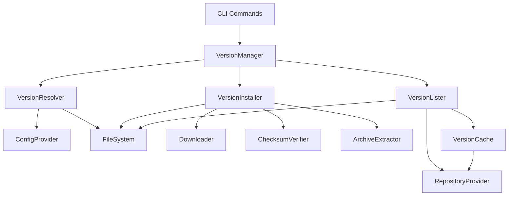
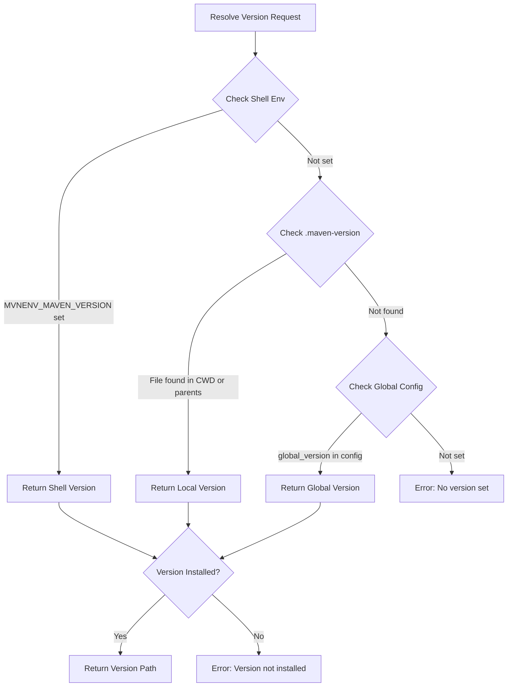
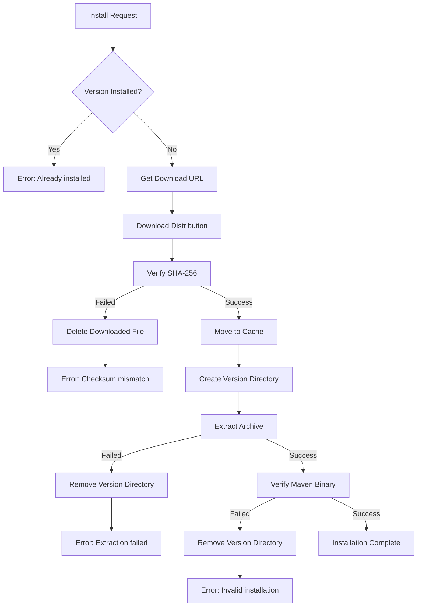

# Design Document

## Overview

The Core Version Management feature implements the business logic for managing Maven installations on Windows. This includes version resolution (determining which Maven version to use), installation/uninstallation operations, version listing, and cache management. The design follows a modular architecture with clear separation between version management, download operations, and configuration.

This feature is called by the CLI commands from cli-commands spec and leverages shared infrastructure (download, config). It provides the core intelligence for Maven version selection and lifecycle management.

**Key Design Goals:**
- Fast version resolution (<100ms)
- Atomic installations with rollback capability
- Clear separation of concerns (resolution, installation, listing)
- Testable components with mockable dependencies
- Windows-native implementation

## Steering Document Alignment

### Technical Standards (tech.md)

**Architecture Patterns:**
- **Repository Pattern**: Abstract version storage and retrieval operations
- **Strategy Pattern**: Version resolution follows shell > local > global strategy
- **Command Pattern**: Install/uninstall as discrete operations with undo capability

**Go Conventions:**
- Package structure: `internal/version/` for private version management logic
- Exported interfaces: `Manager`, `Resolver`, `Installer` for public API
- File naming: `manager.go`, `resolver.go`, `parser.go`, `compare.go` per structure.md

**Dependencies:**
- `internal/download`: Download and checksum verification
- `internal/config`: Configuration file access and path resolution
- `pkg/maven`: Public Maven version structures and utilities

### Project Structure (structure.md)

**Package Organization:**
```
internal/version/
├── manager.go      # VersionManager - orchestrates operations
├── resolver.go     # VersionResolver - determines active version
├── installer.go    # VersionInstaller - install/uninstall logic
├── lister.go       # VersionLister - list installed/available
├── parser.go       # Version string parsing
├── compare.go      # Semantic version comparison
└── cache.go        # Available versions cache management
```

**Naming Conventions:**
- Exported types: `VersionManager`, `VersionResolver`, `VersionInstaller`
- Unexported helpers: `parseVersionString()`, `compareVersions()`
- Interfaces: `Downloader`, `ConfigProvider` for dependency injection

## Code Reuse Analysis

### Existing Components to Leverage

**internal/download (will be shared with nexus-repository-integration):**
- `Downloader` interface: HTTP download with progress tracking
- `ChecksumVerifier`: SHA-256 verification
- `CacheManager`: Downloaded archive management

**internal/config (shared configuration):**
- `ConfigLoader`: Read config.yaml for global version
- `PathResolver`: Resolve %USERPROFILE%\.mvnenv paths
- `RepositoryConfig`: Access configured repositories

**pkg/maven (public utilities):**
- `Version` struct: Represent Maven version (major, minor, patch)
- `ParseVersion()`: Parse version strings to Version struct
- `CompareVersions()`: Semantic version comparison

### Integration Points

**CLI Commands (cli-commands spec):**
- Commands call `VersionManager` methods directly
- Example: `install.go` calls `manager.Install(ctx, version)`

**Nexus Integration (nexus-repository-integration spec):**
- Provides repository list for available versions
- Returns download URLs for Maven distributions

**Shim System (shim-system-implementation spec):**
- Calls `VersionResolver` to determine which Maven to execute
- Uses resolved path to execute correct Maven binary

## Architecture

### Component Architecture



### Version Resolution Flow



### Installation Flow



## Components and Interfaces

### Component 1: VersionManager

**Purpose:** Orchestrates all version management operations (install, uninstall, list, resolve)

**Interfaces:**
```go
type VersionManager struct {
    resolver  *VersionResolver
    installer *VersionInstaller
    lister    *VersionLister
    config    ConfigProvider
}

// NewVersionManager creates a new VersionManager
func NewVersionManager(config ConfigProvider, downloader Downloader) *VersionManager

// Install installs a Maven version
func (m *VersionManager) Install(ctx context.Context, version string) error

// Uninstall removes a Maven version
func (m *VersionManager) Uninstall(version string) error

// ListInstalled returns all installed versions
func (m *VersionManager) ListInstalled() ([]string, error)

// ListAvailable returns all available versions from repositories
func (m *VersionManager) ListAvailable(ctx context.Context) ([]string, error)

// GetCurrentVersion resolves and returns the active version
func (m *VersionManager) GetCurrentVersion() (string, error)

// SetGlobalVersion sets the global default version
func (m *VersionManager) SetGlobalVersion(version string) error

// SetLocalVersion creates .maven-version file in current directory
func (m *VersionManager) SetLocalVersion(version string) error

// GetLatestVersion returns the latest installed version matching optional prefix
func (m *VersionManager) GetLatestVersion(prefix string) (string, error)
```

**Dependencies:**
- `VersionResolver`: For version resolution
- `VersionInstaller`: For install/uninstall operations
- `VersionLister`: For listing versions
- `ConfigProvider`: For configuration access

### Component 2: VersionResolver

**Purpose:** Resolves which Maven version should be active based on hierarchy (shell > local > global)

**Interfaces:**
```go
type VersionResolver struct {
    config     ConfigProvider
    fileSystem FileSystem
}

// NewVersionResolver creates a new VersionResolver
func NewVersionResolver(config ConfigProvider, fs FileSystem) *VersionResolver

// ResolveVersion determines the active Maven version
func (r *VersionResolver) ResolveVersion() (*ResolvedVersion, error)

// GetShellVersion reads MVNENV_MAVEN_VERSION environment variable
func (r *VersionResolver) GetShellVersion() (string, bool)

// GetLocalVersion searches for .maven-version file in current and parent directories
func (r *VersionResolver) GetLocalVersion() (string, error)

// GetGlobalVersion reads global version from config.yaml
func (r *VersionResolver) GetGlobalVersion() (string, error)

// IsVersionInstalled checks if a version exists in versions directory
func (r *VersionResolver) IsVersionInstalled(version string) bool

// GetVersionPath returns the full path to a Maven installation
func (r *VersionResolver) GetVersionPath(version string) string
```

**Data Models:**
```go
type ResolvedVersion struct {
    Version string        // e.g., "3.9.4"
    Source  VersionSource // shell, local, or global
    Path    string        // Full path to Maven installation
}

type VersionSource int
const (
    SourceShell  VersionSource = iota
    SourceLocal
    SourceGlobal
)
```

**Resolution Algorithm:**
```go
func (r *VersionResolver) ResolveVersion() (*ResolvedVersion, error) {
    // 1. Check shell environment variable
    if version, ok := r.GetShellVersion(); ok {
        if !r.IsVersionInstalled(version) {
            return nil, ErrVersionNotInstalled
        }
        return &ResolvedVersion{
            Version: version,
            Source:  SourceShell,
            Path:    r.GetVersionPath(version),
        }, nil
    }

    // 2. Check for .maven-version file
    if version, err := r.GetLocalVersion(); err == nil {
        if !r.IsVersionInstalled(version) {
            return nil, ErrVersionNotInstalled
        }
        return &ResolvedVersion{
            Version: version,
            Source:  SourceLocal,
            Path:    r.GetVersionPath(version),
        }, nil
    }

    // 3. Check global config
    if version, err := r.GetGlobalVersion(); err == nil {
        if !r.IsVersionInstalled(version) {
            return nil, ErrVersionNotInstalled
        }
        return &ResolvedVersion{
            Version: version,
            Source:  SourceGlobal,
            Path:    r.GetVersionPath(version),
        }, nil
    }

    return nil, ErrNoVersionSet
}
```

### Component 3: VersionInstaller

**Purpose:** Handles installation and uninstallation of Maven versions

**Interfaces:**
```go
type VersionInstaller struct {
    downloader Downloader
    config     ConfigProvider
    verifier   ChecksumVerifier
}

// NewVersionInstaller creates a new VersionInstaller
func NewVersionInstaller(downloader Downloader, config ConfigProvider) *VersionInstaller

// Install downloads and installs a Maven version
func (i *VersionInstaller) Install(ctx context.Context, version string) error

// Uninstall removes a Maven version
func (i *VersionInstaller) Uninstall(version string) error

// IsInstalled checks if a version is installed
func (i *VersionInstaller) IsInstalled(version string) bool

// VerifyInstallation verifies a Maven installation is valid
func (i *VersionInstaller) VerifyInstallation(version string) error
```

**Installation Logic:**
```go
func (i *VersionInstaller) Install(ctx context.Context, version string) error {
    // 1. Check if already installed
    if i.IsInstalled(version) {
        return ErrAlreadyInstalled
    }

    // 2. Get download URL from repository provider
    url, checksum, err := i.getDownloadURL(version)
    if err != nil {
        return fmt.Errorf("failed to get download URL: %w", err)
    }

    // 3. Download to cache
    archivePath, err := i.downloader.Download(ctx, url, i.config.CacheDir())
    if err != nil {
        return fmt.Errorf("download failed: %w", err)
    }

    // 4. Verify checksum
    if err := i.verifier.Verify(archivePath, checksum); err != nil {
        os.Remove(archivePath) // Cleanup
        return fmt.Errorf("checksum verification failed: %w", err)
    }

    // 5. Create version directory
    versionDir := filepath.Join(i.config.VersionsDir(), version)
    if err := os.MkdirAll(versionDir, 0755); err != nil {
        return fmt.Errorf("failed to create version directory: %w", err)
    }

    // 6. Extract archive
    if err := extractArchive(archivePath, versionDir); err != nil {
        os.RemoveAll(versionDir) // Rollback
        return fmt.Errorf("extraction failed: %w", err)
    }

    // 7. Verify installation
    if err := i.VerifyInstallation(version); err != nil {
        os.RemoveAll(versionDir) // Rollback
        return fmt.Errorf("installation verification failed: %w", err)
    }

    return nil
}
```

### Component 4: VersionLister

**Purpose:** Lists installed and available versions

**Interfaces:**
```go
type VersionLister struct {
    config    ConfigProvider
    cache     *VersionCache
    repoProvider RepositoryProvider
}

// NewVersionLister creates a new VersionLister
func NewVersionLister(config ConfigProvider, cache *VersionCache, repoProvider RepositoryProvider) *VersionLister

// ListInstalled returns all installed versions sorted by semantic version
func (l *VersionLister) ListInstalled() ([]string, error)

// ListAvailable returns all available versions from repositories
func (l *VersionLister) ListAvailable(ctx context.Context, refresh bool) ([]string, error)

// GetLatest returns the latest version matching optional prefix
func (l *VersionLister) GetLatest(prefix string) (string, error)
```

### Component 5: Version Parsing and Comparison

**Purpose:** Parse and compare Maven version strings

**Interfaces:**
```go
// ParseVersion parses a version string into structured Version
func ParseVersion(versionStr string) (*maven.Version, error)

// CompareVersions compares two versions using semantic versioning
// Returns -1 if v1 < v2, 0 if equal, 1 if v1 > v2
func CompareVersions(v1, v2 string) (int, error)

// SortVersions sorts versions in descending order (newest first)
func SortVersions(versions []string) []string
```

**Implementation:**
```go
// In pkg/maven/version.go
type Version struct {
    Major      int
    Minor      int
    Patch      int
    Qualifier  string // e.g., "alpha", "beta", "RC1"
}

func ParseVersion(versionStr string) (*Version, error) {
    // Parse "3.9.4" or "3.9.0-beta-1" format
    // Return structured Version
}

func (v *Version) Compare(other *Version) int {
    if v.Major != other.Major {
        return v.Major - other.Major
    }
    if v.Minor != other.Minor {
        return v.Minor - other.Minor
    }
    if v.Patch != other.Patch {
        return v.Patch - other.Patch
    }
    // Compare qualifiers lexicographically
    return strings.Compare(v.Qualifier, other.Qualifier)
}
```

## Data Models

### Version Configuration

```go
// In internal/config/config.go
type Config struct {
    GlobalVersion string `yaml:"global_version"`
    // Other config fields
}

// GetGlobalVersion returns the configured global version
func (c *Config) GetGlobalVersion() string {
    return c.GlobalVersion
}

// SetGlobalVersion updates the global version in config
func (c *Config) SetGlobalVersion(version string) error {
    c.GlobalVersion = version
    return c.Save()
}
```

### Version Cache

```go
// VersionCache manages cached available versions
type VersionCache struct {
    cachePath  string
    ttl        time.Duration
}

type CachedVersions struct {
    Versions  []string  `json:"versions"`
    Timestamp time.Time `json:"timestamp"`
}

func (c *VersionCache) Get() ([]string, error) {
    // Read cache file
    // Check if stale (timestamp > TTL)
    // Return versions or nil if stale
}

func (c *VersionCache) Set(versions []string) error {
    // Write versions with current timestamp
}
```

## Error Handling

### Error Types

```go
var (
    ErrVersionNotInstalled = errors.New("version not installed")
    ErrAlreadyInstalled   = errors.New("version already installed")
    ErrNoVersionSet       = errors.New("no Maven version set")
    ErrInvalidVersion     = errors.New("invalid version format")
    ErrDownloadFailed     = errors.New("download failed")
    ErrChecksumMismatch   = errors.New("checksum verification failed")
    ErrExtractionFailed   = errors.New("archive extraction failed")
    ErrInstallationInvalid = errors.New("installation verification failed")
)
```

### Error Scenarios

**1. Version Not Installed**
- **Handling:** Return ErrVersionNotInstalled with version details
- **User Impact:** "Error: version '3.9.4' not installed. Run 'mvnenv install -l' to see available versions."

**2. Already Installed**
- **Handling:** Return ErrAlreadyInstalled, no operation performed
- **User Impact:** "Error: version '3.9.4' already installed"

**3. Download Failure**
- **Handling:** Wrap network error, cleanup partial files
- **User Impact:** "Error: download failed: connection timeout"

**4. Checksum Mismatch**
- **Handling:** Delete downloaded file, return ErrChecksumMismatch
- **User Impact:** "Error: checksum verification failed for Maven 3.9.4"

**5. Extraction Failure**
- **Handling:** Remove version directory (rollback), return ErrExtractionFailed
- **User Impact:** "Error: failed to extract archive: invalid zip format"

## Testing Strategy

### Unit Testing

**VersionResolver Tests:**
- Test shell > local > global precedence
- Test .maven-version file discovery in parent directories
- Test error handling when no version set
- Mock FileSystem and ConfigProvider

**VersionInstaller Tests:**
- Test successful installation flow
- Test rollback on checksum failure
- Test rollback on extraction failure
- Mock Downloader and FileSystem

**Version Comparison Tests:**
- Test semantic version comparison (3.9.0 > 3.8.10)
- Test qualifier handling (3.9.0 > 3.9.0-beta)
- Test sorting of version lists

### Integration Testing

**Installation Integration:**
- Test full installation with real filesystem (temp directory)
- Test uninstallation cleanup
- Test concurrent installation prevention

**Resolution Integration:**
- Test version resolution with real config files
- Test .maven-version file in nested directories
- Test environment variable override

### Performance Testing

**Benchmarks:**
- Version resolution: Target <100ms
- List installed: Target <100ms
- Version comparison: Target <1ms

```go
func BenchmarkResolveVersion(b *testing.B) {
    resolver := NewVersionResolver(config, fs)
    for i := 0; i < b.N; i++ {
        _, _ = resolver.ResolveVersion()
    }
}
```

## Implementation Notes

### Atomic Installation Pattern

Use temporary directory during extraction, then atomic rename:

```go
// Extract to temp directory
tempDir := filepath.Join(cacheDir, "tmp-"+version)
if err := extractArchive(archivePath, tempDir); err != nil {
    os.RemoveAll(tempDir)
    return err
}

// Verify before committing
if err := verifyInstallation(tempDir); err != nil {
    os.RemoveAll(tempDir)
    return err
}

// Atomic move to final location
finalDir := filepath.Join(versionsDir, version)
if err := os.Rename(tempDir, finalDir); err != nil {
    os.RemoveAll(tempDir)
    return err
}
```

### Concurrent Installation Prevention

Use file locks to prevent concurrent installations:

```go
lockFile := filepath.Join(cacheDir, "."+version+".lock")
lock, err := acquireFileLock(lockFile)
if err != nil {
    return ErrConcurrentInstallation
}
defer lock.Release()
```

### Windows Path Handling

Always use `filepath` package for cross-platform paths:

```go
// Correct
versionPath := filepath.Join(baseDir, "versions", version)

// Incorrect (Unix-only)
versionPath := baseDir + "/versions/" + version
```
